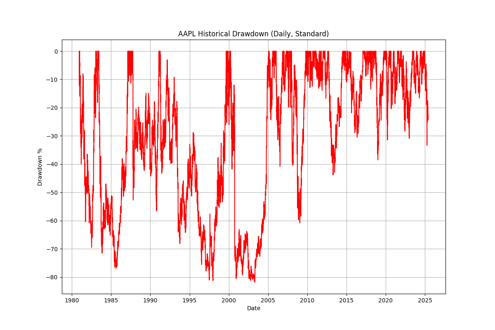

# Stock Drawdown Analysis Tool

A Python tool for analyzing and visualizing historical drawdowns of stocks and indices. Track the peak-to-trough declines of any publicly traded stock or index.

## What is a Drawdown?

A drawdown shows how much an investment is down from its peak value. For example:
- If a stock reaches $100, then falls to $80, it has a -20% drawdown
- If it then rises to $90 and falls to $70, it has a -30% drawdown from its $100 peak

Example Drawdown Chart for Apple (AAPL):



## What This Tool Provides

For any stock symbol (e.g., AAPL, MSFT, ^GSPC), you get:

1. **Data Files** (CSV format):
   - Historical drawdown percentages
   - Dates of all drawdowns
   - Easy to open in Excel/Google Sheets

2. **Visualization** (Two views):
   - Standard View: Drawdowns shown as negative percentages
   - Flipped View: Drawdowns shown as positive percentages (useful for comparing with other metrics)

3. **Multiple Timeframes**:
   - Daily drawdowns (most detailed)
   - Monthly drawdowns (smoother view)
   - Quarterly drawdowns (long-term perspective)

Example Output Structure:
```
drawdowns/
└── AAPL/
    ├── daily/
    │   ├── drawdown_data.csv
    │   ├── drawdown_standard.png
    │   └── drawdown_flipped.png
    ├── monthly/
    │   └── [same files]
    └── quarterly/
        └── [same files]
```

## Quick Start (For Experienced Users)

```bash
git clone https://github.com/finnjclancy/drawdowns.git
cd drawdowns
pip install -r requirements.txt
python drawdown.py AAPL
```

## Common Stock Symbols

- Apple: AAPL
- Microsoft: MSFT
- Google: GOOGL
- Amazon: AMZN
- S&P 500 Index: ^GSPC
- Tesla: TSLA
- Netflix: NFLX

## Detailed Installation Guide

### For macOS Users

1. **Install Python**:
   - Visit the official Python website: https://www.python.org/downloads/
   - Click the big yellow "Download Python" button
   - Open the downloaded file (it will be named something like "python-3.x.x-macos.pkg")
   - Follow the installation wizard, clicking "Continue" and "Install"

2. **Open Terminal**:
   - Press `Command (⌘) + Space` to open Spotlight Search
   - Type "Terminal" and press Enter
   - You'll see a black or white window with text - this is your Terminal

3. **Download this tool**:
   - Copy and paste this command into Terminal and press Enter:
     ```bash
     git clone https://github.com/finnjclancy/drawdowns.git
     ```
   - Then enter this command:
     ```bash
     cd drawdowns
     ```

4. **Install required packages**:
   - Copy and paste this command and press Enter:
     ```bash
     pip install -r requirements.txt
     ```
   - Wait for the installation to complete

### For Windows Users

1. **Install Python**:
   - Visit https://www.python.org/downloads/
   - Click the big yellow "Download Python" button
   - Open the downloaded file (named like "python-3.x.x-amd64.exe")
   - **IMPORTANT**: Check the box that says "Add Python to PATH" before clicking Install
   - Click "Install Now"

2. **Open Command Prompt**:
   - Press `Windows key + R`
   - Type "cmd" and press Enter
   - You'll see a black window with text - this is your Command Prompt

3. **Download this tool**:
   - First, install Git:
     - Visit https://git-scm.com/download/win
     - Download and run the installer (use all default options)
   - In Command Prompt, copy and paste:
     ```bash
     git clone https://github.com/finnjclancy/drawdowns.git
     ```
   - Then type:
     ```bash
     cd drawdowns
     ```

4. **Install required packages**:
   - Copy and paste this command:
     ```bash
     pip install -r requirements.txt
     ```
   - Wait for the installation to complete

## How to Use

### Basic Usage

1. **Start the program**:
   ```bash
   python drawdown.py
   ```

2. **Enter a stock symbol** when prompted (e.g., AAPL, MSFT, ^GSPC)

3. **Find your results** in the 'drawdowns' folder:
   - CSV files for data analysis
   - PNG files for visual analysis

### Advanced Usage

1. Analyze multiple stocks at once:
   ```bash
   python drawdown.py AAPL MSFT SPY
   ```

2. Choose specific time periods:
   ```bash
   python drawdown.py AAPL -f daily monthly
   ```

## Troubleshooting

1. **"Python not found" error**:
   - macOS: Reinstall Python from python.org
   - Windows: Make sure you checked "Add Python to PATH" during installation

2. **"Git not found" error**:
   - macOS: Install Git using the instructions at https://git-scm.com/download/mac
   - Windows: Install Git using the instructions at https://git-scm.com/download/win

3. **"No module named..." error**:
   - Run: `pip install -r requirements.txt`

4. **"Invalid ticker symbol" error**:
   - Make sure you're using the correct stock symbol
   - Try using the common symbols listed above

Need more help? Feel free to open an issue on GitHub!

## Technical Details

- Data Source: Yahoo Finance (via yfinance package)
- Dependencies: pandas, matplotlib, yfinance
- Python Version: 3.x required

